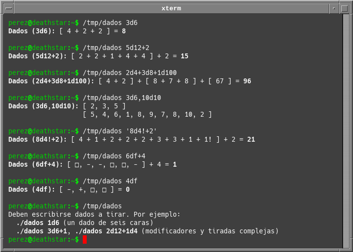

Imagine a small group of friends role-playing in Telegram.

Of course, RPGs need dice or some other way to get random numbers. So we tried a couple of Telegram bots designed for that, which somewhat worked but not really to our liking. And then, just before Christmas 2022, someone lightheartedly proposed:

—Pérez, you could write a dice-throwing Telegram bot for our group.

And another guy, a complete joker, added:

—And write it in COBOL!

Challenge accepted! So a Telegram bot I wrote. And did it (mostly) in COBOL, because why use an easy and common solution when there are hard and exotic ones? So I turned on my old green-phosphor-text-on-black-screen computer and the result is...

# TirarDados

**TirarDados** (in English would be "ThrowDice") does exactly that: throws dice, and displays the rolls and results to the user or Telegram chat group. It started as an small and simple program, now isn't so small or simple anymore.

## What it does:

At the moment **TirarDados** supports:

- Common dice and modifiers in the usual notation: `1d8`, `6d12`, `4d4+1`
- Complex rolls with different dice: `2d6+1d4`, `1d20+1d10`
- Of course, subtraction: `1d20-1`, `1d10-1d4`
- Independent dice series delimited by commas, no totals: `3d6,5d6`, or `4d6,` for a single series.
- Exploding dice: `3d8!`, `5d6!`
- [Fudge dice](https://en.wikipedia.org/wiki/Fudge_(role-playing_game_system)): `3df`, `6df+4`

In fact the bot can throw crazy things like `1d20-2d4+10d6!+4`, which I can't imagine any existing game ever required. There's a limit of 99 dice per roll, and 99999 sides per dice (that would be `99d99999`). This should be enough for any conceivable situation; oh, most probably is complete overkill.

The program can display its output in an Unix terminal, using Unicode and ANSI escape sequences for formatting, or in Telegram with Markdown and emojis.

For example, the program running in Xterm:

Or in a Telegram chat:

## How it works:

**Tirardados** consists of two different pieces:

- The program for throwing dice and displaying the results, with resides mainly in the `dados.cob` file. Written in COBOL, it can be compiled with [GnuCOBOL](https://gnucobol.sourceforge.io) in Linux or any other Unix-like system, or even Android. It can be run as any independent terminal application.

- The bot itself, `tirardados.py`, written in Python with the help of [pyTelegramBotAPI](https://pypi.org/project/pyTelegramBotAPI/).

When asked, the bot runs the COBOL program to throw the required dice and shows the results in the chat with appropiate formatting.

(Of course all this could have been written, fast, in Python. But where would the fun be then?)

## Caveats:

- I would like to write a better parser, as this one looks to me somewhat fragile.

- COBOL code with comments in Spanish. Enjoy.

- Program output in Spanish too (mainly the error messages).
